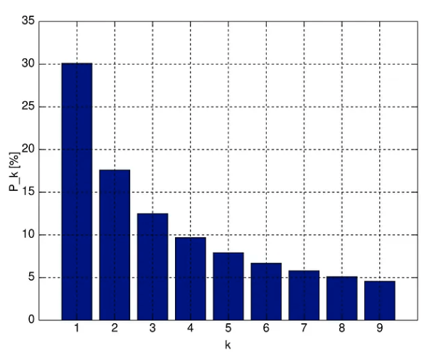

When we talk about data fraud detection, most people think of complex models, AI pipelines, or forensic accounting teams armed with custom algorithms.  
But sometimes, one of the most powerful tools is also one of the simplest.
<!--more-->

Meet **Benford's Law** — a statistical phenomenon that shows up in countless natural datasets and can instantly reveal manipulation, fraud, or large-scale human error.  
And yet… very few analysts use it.

---

## The Strange Pattern Hidden in Natural Numbers

Here's a surprising fact:

In many real-world datasets, the leading digit **"1"** appears about **30%** of the time.  
Not 10%.  
Not evenly distributed across 1 to 9.  
**Thirty percent.**

This counter-intuitive pattern was observed as early as the 19th century and later formalized by physicist **Frank Benford** in 1938. He noticed that datasets — like river lengths, electricity bills, sales transactions, stock prices, or scientific constants — followed a very similar distribution of leading digits:

- **1** ≈ 30.1%  
- **2** ≈ 17.6%  
- **3** ≈ 12.5%  
- … and so on …  
- **9** ≈ 4.6%

This is **Benford's Law**.

---

## Why Does This Happen?

Benford's Law emerges in datasets that:

- Span multiple orders of magnitude  
- Grow naturally over time  
- Are not artificially bounded  
- Are not human-generated round numbers  

Think of real-world quantities: population sizes, financial transaction amounts, file sizes, physical measurements.

These values tend to grow multiplicatively, and their distribution naturally shifts toward lower leading digits.

**The result?**  
A remarkably stable pattern that repeats across domains, countries, and time periods.

---

## Why Benford's Law Is a Weapon Against Fraud

Humans are predictable in their unpredictability.

When people try to manipulate data — alter invoices, fake expense reports, fabricate numbers — they don't reproduce Benford's Law. They tend to create distributions that look *too uniform*, or make certain digits appear more than they naturally should.

That's where Benford's Law becomes a **red flag detector**.

It helps uncover:

- ✔ **Accounting anomalies**  
  Fraudulent journals, inflated revenues, round-number biases.
- ✔ **Data tampering**  
  Manually edited logs, altered survey responses.
- ✔ **Financial fraud**  
  Expense claims, reimbursement padding.
- ✔ **Large-scale input errors**  
  Mistyped values, systematic mistakes, corrupted imports.

If the dataset's leading-digit distribution deviates significantly from Benford's expected curve… **something is almost certainly wrong**.

It doesn't prove intent, but it highlights exactly where to look.

---

## How Analysts Can Use Benford's Law

Benford's Law is incredibly easy to test.

Most BI or analytics tools can compute leading-digit frequencies in seconds. You can apply it to:

- Invoice databases  
- Sales transactions  
- Operational logs  

The process is straightforward:

1. Extract the leading digit from each numerical value  
2. Compute the distribution  
3. Compare against Benford's expected distribution  
4. Investigate the deviations  

Even small mismatches can reveal major insights.

---

## Why Don't More Analysts Use It?

Despite its power, Benford's Law is often overlooked because:

- Many analysts simply aren't aware of it  
- It seems *"too simple"* to matter  
- Its counterintuitive nature leads to skepticism  
- It's rarely taught in standard analytics or accounting curricula  
- Teams rely heavily on machine learning instead of statistical fundamentals  

But simplicity is exactly what makes it valuable.

It's fast.  
It doesn't require modeling assumptions.  
And it works unbelievably well for certain types of datasets.

---

## A Simple Tool, Massive Impact

In a world where data systems are more complex than ever, sometimes the most elegant solutions come from fundamental mathematics.

Benford's Law won't replace AI fraud detection models.  
But it will catch anomalies long before most analysts ever think to look.

So the next time you're handed a messy dataset or financial ledger and something feels off, try the simplest test in the book:

**Check the first digits.**  
The numbers might be trying to tell you something.

